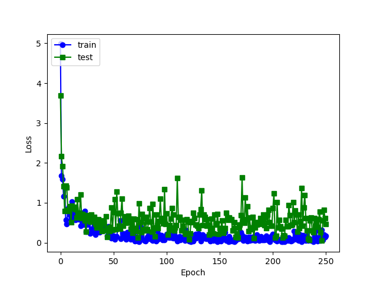
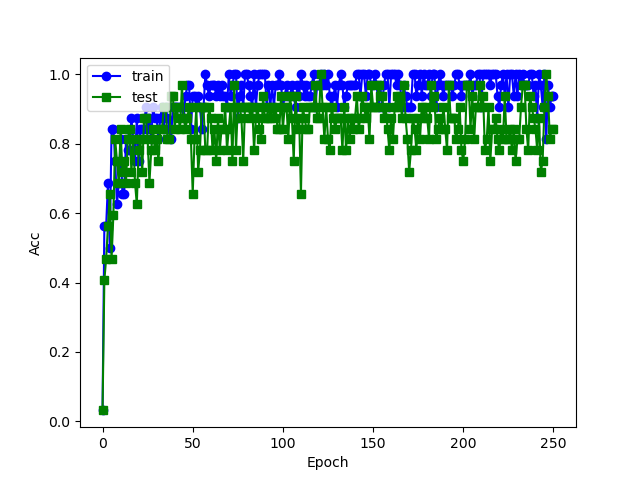

# PointNet

This repo is implementation for PointNet by Pytorch. The model can be trained by ModelNet40 or ShapeNet. You can also download the trained model for test.

  # Usage:

  ## Training 

  - you should set the task ： `--task cls <cls | seg>`  
  - you should set the outf：`--outf <name output folder>`
  - Use `--feature_transform` to set whether use feature_transform or not

------

#### Classification

- Can use ModelNet40 or ShapeNet do classification：

```
cd pointnet
python train_net.py --task cls --dataset <dataset path> --nepoch <number epochs> --batch_size <batchsize> --dataset_type <modelnet40 | shapenet>
```

-  This is a example with feature transform：show the loss curve and the acc curve trained by 250 epochs






#### Segmentation

- Only use ShapeNet do segmentation：

```
cd pointnet
python train_net.py --task seg --dataset <dataset path> --nepoch <number epochs> --batch_size <batchsize> --dataset_type shapenet
```


  ## Evaluation

#### Classification

```
python eval.py --task cls --dataset <dataset path> --model <model path> --dataset_type <modelnet40 | shapenet>
```

- On ModelNet40

|                                              | Overall Acc | trained                                                      |
| :------------------------------------------: | :---------: | ------------------------------------------------------------ |
|           Original implementation            |    89.2     |                                                              |
| this implementation（w/o feature transform） |    86.5     | [model](https://github.com/adrien-Chen/pointnet_by_dw/blob/master/cls/cls_model_249.pth) |
| this implementation（w/ feature transfoem）  |    86.9     | [model](https://github.com/adrien-Chen/pointnet_by_dw/blob/master/cls/cls_model_246.pth) |


- On ShapeNet

|                                              | Overall Acc | trained                                                      |
| :------------------------------------------: | :---------: | ------------------------------------------------------------ |
|           Original implementation            |     N/A     |                                                              |
| this implementation（w/o feature transform） |    96.9     | [model](https://github.com/adrien-Chen/pointnet_by_dw/tree/master/cls) |
| this implementation（w/ feature transfoem）  |    97.2     | [model](https://github.com/adrien-Chen/pointnet_by_dw/blob/master/cls/cls_model_29.pth) |


#### Segmentation

|                 Class(mIOU)                  | Airplane | trained                                                      |
| :------------------------------------------: | :------: | ------------------------------------------------------------ |
|           Original implementation            |   83.4   |                                                              |
| this implementation（w/o feature transform） |   77.6   | [model](https://github.com/adrien-Chen/pointnet_by_dw/blob/master/seg/seg_model_Airplane_59.pth) |
| this implementation（w/ feature transfoem）  |   78.1   | [model](https://github.com/adrien-Chen/pointnet_by_dw/blob/master/seg/seg_model_Airplane_89.pth) |


